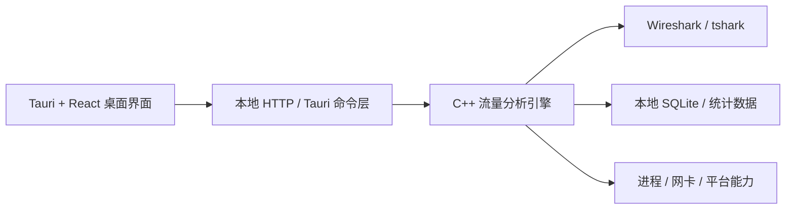

# EasyTshark

EasyTshark 是一款面向桌面端的网络抓包与流量分析工具，目标是在保留专业分析能力的同时，尽可能降低 Wireshark / tshark 的使用门槛。

它提供了更易理解的桌面界面、面向会话的流量视角、统计分析能力，以及网络流量与本地进程的关联分析能力，适合用于网络协议学习、问题排查、性能分析和安全审计等场景。


## 项目亮点

- 基于 Wireshark / tshark 内核，具备成熟的数据包解析能力
- 支持实时抓包与离线文件分析两种工作模式
- 以“数据包 + 会话 + 统计 + 进程”四种视角组织分析结果
- 支持 TCP、UDP、DNS、HTTP、SSL/TLS、SSH 等常见协议会话分析
- 支持 IP 统计、协议统计、国家统计等图表化分析
- 支持将网络通信与本地进程关联，便于定位“哪个程序在联网”
- 支持历史分析文件管理、会话保存、导入与导出
- 桌面端跨平台，当前工程覆盖 Windows、macOS、Linux
- 界面轻量，适合作为日常网络排障和教学演示工具

## 界面预览

### 数据包列表

适合从细粒度维度查看抓到的每一条数据包，并结合过滤条件快速定位问题。


### 会话详情

从会话维度查看双向通信过程，比直接阅读原始数据包更适合分析业务交互链路。


### 统计分析

提供 IP、协议、国家等统计结果，适合快速识别热点通信对象和流量分布。


### 进程分析

将流量与本机进程关联，帮助回答“哪个进程在发起连接”。


## 核心功能

### 1. 实时抓包

- 选择网卡后启动实时抓包
- 支持抓包过程中切换分析视图
- 支持监控网卡流量趋势

### 2. 离线文件分析

- 支持导入 `pcap`、`pcapng`、`cap` 等抓包文件
- 支持历史分析文件列表管理
- 适合复盘线上问题或教学演示

### 3. 数据包分析

- 全量数据包视图
- ARP / ICMP / ICMPv6 等专题视图
- 更适合做底层协议细节分析

### 4. 会话分析

- TCP 会话
- UDP 会话
- DNS 会话
- HTTP 会话
- SSL/TLS 会话
- SSH 会话
- 会话详情查看与管理

### 5. 统计分析

- IP 统计
- 协议统计
- 国家统计
- 图表化展示流量分布和热点对象

### 6. 进程关联分析

- 把通信流量与本机进程进行关联
- 适合排查异常联网、后台上传、性能瓶颈等问题

### 7. 桌面体验

- 多主题 / 背景切换
- 桌面端原生窗口能力
- 面向日常使用做了更简化的交互设计

## 适用场景

- 网络协议学习与教学演示
- 应用联网行为排查
- 服务器或客户端通信故障定位
- DNS / HTTP / TLS 问题分析
- 内网访问异常、慢请求、连接失败问题排查
- 安全审计与异常流量观察
- 日常性能优化与网络行为基线分析

## 技术架构

EasyTshark 采用“桌面前端 + 本地分析引擎”的结构：



### 前端

- 技术栈：Tauri 2、React、TypeScript、Arco Design
- 负责界面展示、交互流程、图表渲染、文件选择和桌面端壳层能力

### 引擎

- 技术栈：C++、SQLite、本地 HTTP 服务
- 负责抓包、协议解析、数据落库、会话组织、统计计算、进程关联等核心逻辑

### 依赖能力

- 底层抓包与协议解析依赖 Wireshark / tshark
- 当前版本默认不再内置 Wireshark，需要用户自行安装

## 仓库结构

```text
easytshark/
├── easytshark-frontend/      # Tauri + React 桌面应用
└── easytshark-server-cpp/    # C++ 抓包与分析引擎
```

### `easytshark-frontend`

- `src/`：前端页面、组件、状态和样式
- `src-tauri/`：Tauri Rust 入口、桌面配置、打包相关文件
- `resources/`：各平台运行时资源
- `scripts/`：辅助构建脚本

### `easytshark-server-cpp`

- `tshark_server/`：核心引擎源码
- `controller/`：本地接口控制层
- `sql/`：查询与统计相关 SQL 片段
- `third_library/`：随仓库管理的第三方依赖

## 平台支持

- Windows
- macOS
- Linux

项目中包含对应平台的打包脚本与资源准备逻辑，当前桌面端主工程位于 `easytshark-frontend`。

## 环境依赖

### 运行依赖

- Wireshark / tshark
- 建议使用 Wireshark 4.2 或更高版本

### 开发依赖

- Node.js 18+
- Rust / Cargo
- 平台对应的 Tauri 构建依赖
- Windows 下如需生成安装包，还需要 NSIS

## 快速开始

### 1. 安装 Wireshark / tshark

请先在本机安装 Wireshark，确保 `tshark` 可用。

- 官网下载：[Wireshark Download](https://www.wireshark.org/download.html)

### 2. 安装前端依赖

```bash
cd easytshark-frontend
npm install
```

### 3. 启动开发环境

```bash
npm run tauri-dev
```

### 4. 构建桌面安装包

```bash
# Windows
npm run tauri-build-win

# macOS
npm run tauri-build-mac

# Linux
npm run tauri-build-linux
```

更详细的构建说明见：

- [easytshark-frontend/BUILD.md](/Users/xuanyuan/Documents/AI-Program/easytshark/easytshark-frontend/BUILD.md)

## 设计目标

EasyTshark 并不是要替代 Wireshark，而是希望在以下方面提供更适合日常使用的体验：

- 用更轻量的桌面应用封装常见分析流程
- 用会话视角降低原始数据包阅读成本
- 把统计分析和进程分析能力前置到主界面
- 让更多非专业网络工程师也能快速上手抓包排障

## 许可证与依赖说明

- 本仓库源码采用 [Apache License 2.0](./LICENSE)
- 项目运行时会调用 Wireshark 项目的 tshark 能力进行数据包分析
- 使用、分发或二次开发时，请同时关注 Wireshark / tshark 及其他第三方依赖各自的许可证要求

## 相关链接

- 产品页：[EasyTshark 介绍页](https://www.xuanyuancode.com/easytshark)
- Wireshark 官网：[https://www.wireshark.org/](https://www.wireshark.org/)

## 作者与公众号

作者：轩辕之风

个人网站：[https://www.xuanyuancode.com](https://www.xuanyuancode.com)

如果这个项目对你有帮助，欢迎关注微信公众号 **轩辕的编程宇宙**。

公众号会持续更新：

- EasyTshark 的功能迭代与版本动态
- AI编程与AI智能体开发技术
- 网络安全领域技术分享
- 其他我正在持续打磨的开源项目与技术内容


也欢迎通过 Issue 和 Pull Request 参与共建。
